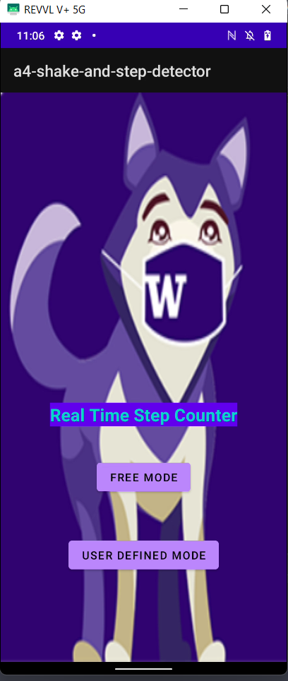
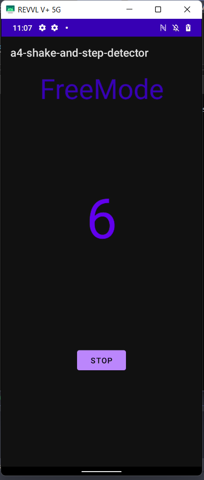
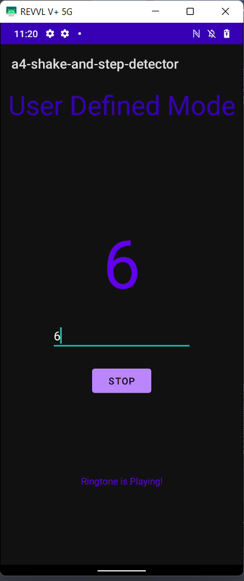

See the [requirements in requirements.md](requirements.md) or on Canvas. 

When you are ready, edit this file with the following info: 

# A1: Hello Android (Your Name Here)

## Overview

I built a thing that does something. But tell me what you built! 

## Using the app 

Tell me anything I need to know about running the app. 

## Walkthrough

Include some screenshots and information. Put the screenshots in the [imgs](imgs) directory, and include them in this readme like this: 

Or use html to resize it: 

 

## Reflection/Summary

Summary of why you chose this project, what you learned or found surprising, what you found challenging or unexpected. You might include something you didn't finish or polish or would like to do different in the future. 

